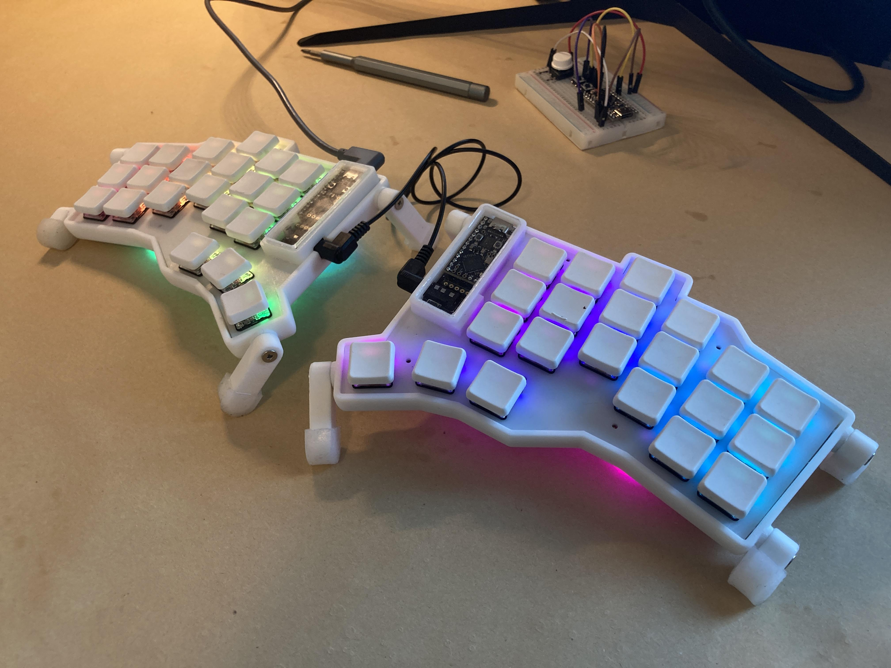

# Philoctetes Keyboard

## About this project

I have worked on this project for about 3 months. It is quite enjoyable, but also time consuming. I made two working keyboards, one bluetooth and one wireless. The feel of the layout is fantastic! Even if my keyboards are working, it's not ready for other people to build. I hope to have time to continue this project, but I can't make promises to anyone. I am sharing this repository for people who might be curious, and to give ideas so as to inspire people to make awesome keyboards.

__Design goals__  
In [congnitive load theory](https://practicalpie.com/cognitive-load-theory/) there are three processes. These are, the intrinsic, the extrinsic, and the germane. The effort put into typing on a keyboard is purely extrinsic. So one day I had an idea, "could I reduce the extrinsic load of typing on a computer by changing my keyboard?". I think the answer is yes. As a result of this idea, my design goals gravitated toward 42 keys that are arranged to match my hand and the movements of my fingers.

This keyboard turned into a very expensive build. It is probably one of the most expensive split keyboards you can build. In addition I only considered the shape and size of my own hand when designing it. Please don't build it.

## Other Projects to Check Out

The [Totem](https://github.com/GEIGEIGEIST/TOTEM) keyboard. The Totem was the inspiration for this keyboard. I have huge respect for the creator of this project. The creator really put a lot of effort into making a great finished project.

I created this project with a different design goal in mind. The design goals of the Totem seem to be a portable and relativly low cost keyboard, my design goals are to fit perfectly my own hand.

In addition, a big thanks to the [EIGA](https://www.youtube.com/@EIGAtech) youtube channel. Without their channel I would not have learned about the Totem and other split keyboards.

## To Do

### Case
[x] Add a case mount point to the far outside.  
[x] Add more space for the oled (the oled is not centered and it hits the lip holding the cover). Moving the oled mount half a mm towards the edge should help.  
[x] Add more space for the microcontroller (about 1mm on the inner side should do).  
[x] Add a curve for the TRRS conector.  

### PCB Both sides
[] change the footprints from sod-323 to sod-323-handsolder.  
[] Update the footprints in the PCB builder.  
[] Repair and update nets.  
[] Recheck routing.  
[] Move diodes to better accomidate case.  
[] Improve the footprint placement of the diodes. They are too close together and the Ali-express diodes don't fit well.  
[] Improve the silkscreen placements.  
[x] Improve the placement of the oled display.  
[x] Add a case mount point to the far outside.  
[x] Add a pull down resistor to the right side.  
[x] Remove the extra diode on the left side.  
[x] Panelize the keyboard.  
[x] Check the column and row labels and makes sure they match.  
[x] Check the oled and nice!view pinouts.  
  
## Project In General  
[] Create a bill of materials  
[] Create a build guide  
[] Test latest PCB  
  
## Case  
  
The case uses a tenting system that I have used for a year. It's not perfect, but every-time I think of switching to a different design I can't find justification. The advantage of my tenting system is that it is very stable and very adjustable. My tenting system is not portable, meaning it will probably bet messed up if you put it in a bag and ride the subway (been there, done that).  
  
The case was designed using onshape and you can find a link to it [here](https://cad.onshape.com/documents/5c5e04ae1784123d6189c14c/w/86f29d74e9109abb974cb649/e/b3c51a35815c88e0a251e0eb?renderMode=0&uiState=679c96c15b955f7398b0b3b0)  

## Images
You may have noticed in this image the top plate is mounted on top of the keyswitches. It's much better to mount them under the keyswitches. I updated the case to accomodate this and am waiting on the delivery of the new part.

